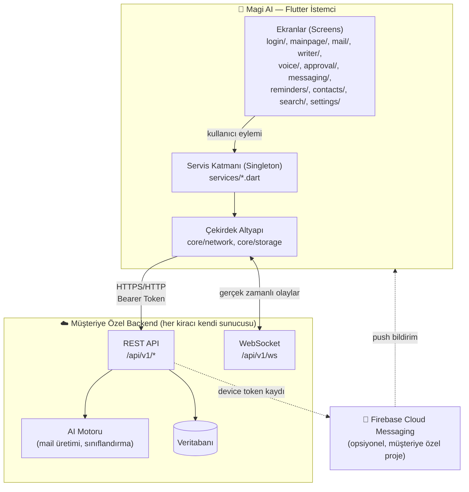
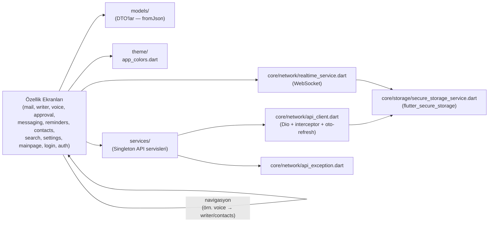
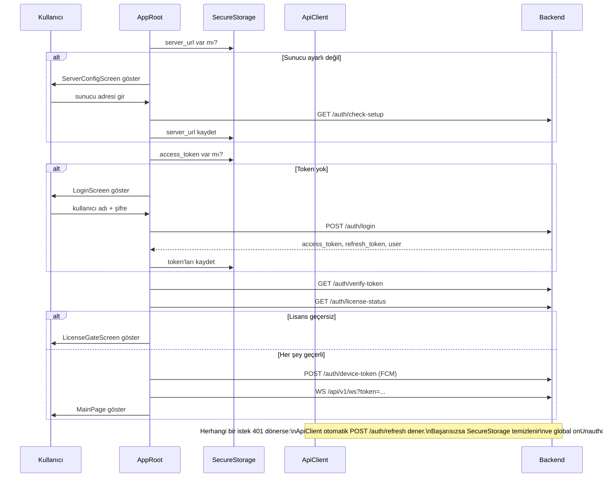
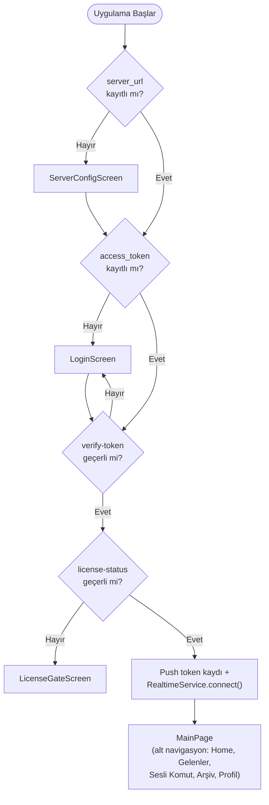
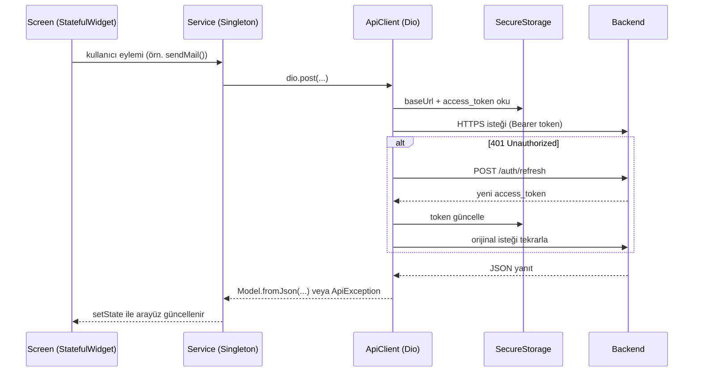
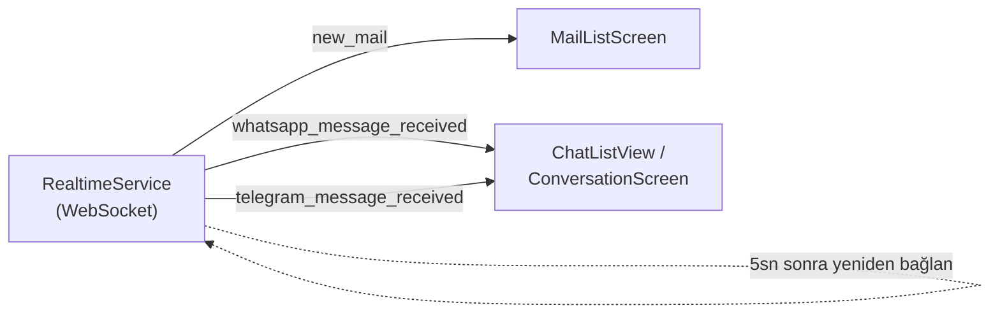

# Magi AI — Mail Assistant Mobile

Flutter ile geliştirilmiş, yapay zeka destekli çoklu-kiracı (multi-tenant) mail & mesajlaşma asistanı mobil istemcisi. Uygulama; e-posta, WhatsApp ve Telegram trafiğini tek bir arayüzde toplar, AI tarafından üretilen yanıtları insan onayına sunar ve gerçek zamanlı bildirimlerle kullanıcıyı güncel tutar.

> Paket adı: `mail_assistant_mobile` · Görünen ad: **Magi AI** · Flutter SDK: `^3.11.1`

## İçindekiler

- [Özellikler](#özellikler)
- [Mimari Genel Bakış](#mimari-genel-bakış)
- [Katman Bağımlılık Şeması](#katman-bağımlılık-şeması)
- [Modül Haritası](#modül-haritası)
- [Kimlik Doğrulama Akışı](#kimlik-doğrulama-akışı)
- [Uygulama Açılış Akışı](#uygulama-açılış-akışı)
- [Veri Akışı (İstek/Yanıt)](#veri-akışı-istekyanıt)
- [Gerçek Zamanlı Olaylar (WebSocket)](#gerçek-zamanlı-olaylar-websocket)
- [Kullanılan Başlıca Paketler](#kullanılan-başlıca-paketler)
- [Platform Desteği & İzinler](#platform-desteği--i̇zinler)
- [Proje Yapısı](#proje-yapısı)
- [Başlarken](#başlarken)

## Özellikler

- **Çoklu-kiracı mimari** — her müşteri kendi backend sunucu adresini uygulamaya girer, sabit kodlanmış bir API adresi yoktur.
- **Birleşik gelen kutusu** — e-posta, WhatsApp ve Telegram mesajları tek arayüzden yönetilir.
- **AI destekli yazım** (`writer/`) — seçilen hesap üzerinden AI tarafından mail içeriği üretme ve gönderme.
- **Onay kuyruğu** (`approval/`) — AI'nin oluşturduğu taslaklar gönderilmeden önce insan onayına düşer (FIFO).
- **Sesli komut** (`voice/`) — metin tabanlı komutlarla uygulama içi navigasyon ve aksiyon tetikleme.
- **Evrensel arama** (`search/`) — mail, WhatsApp ve Telegram genelinde tek arama.
- **Hatırlatıcılar & kişiler** — VIP kişi işaretleme, AI işleme aç/kapa, hatırlatıcı yönetimi.
- **Gerçek zamanlı güncellemeler** — WebSocket üzerinden yeni mail/mesaj bildirimleri.
- **Lisans doğrulama** — açılışta lisans durumu kontrol edilir, geçersizse erişim kısıtlanır.

## Mimari Genel Bakış



## Katman Bağımlılık Şeması

Bağımlılıklar tek yönlüdür, döngü yoktur: `core/` en alt katmandır, hiçbir üst katmana bağımlı değildir.



## Modül Haritası

| Modül | Sorumluluk |
|---|---|
| `app_root.dart` | Açılış sıralamasını yönetir: sunucu adresi → token → lisans → ana sayfa |
| `main.dart` | Uygulama girişi, tema durumu (`themeNotifier`), global 401 yönlendirmesi (`rootNavigatorKey`) |
| `core/network/` | `ApiClient` (Dio, oto token yenileme), `RealtimeService` (WebSocket), `ApiException` |
| `core/storage/` | `SecureStorageService` — sunucu adresi, access/refresh token, cihaz token |
| `services/` | Her biri Singleton: `auth`, `mail`, `writer`, `voice`, `approval`, `messaging`, `telegram_connection`, `whatsapp_connection`, `reminders`, `contacts`, `search`, `accounts`, `dashboard`, `profile`, `push_notification` |
| `auth/` | `ServerConfigScreen`, `LicenseGateScreen` |
| `login/` | Kullanıcı adı/şifre girişi ekranı |
| `mainpage/` | Alt navigasyon, istatistik kartları, arama çubuğu, hızlı erişim |
| `mail/` | Gelen kutusu / arşiv listesi ve mail detay/thread ekranı |
| `writer/` | AI destekli yeni mail oluşturma ve gönderme |
| `voice/` | Metin tabanlı sesli komut ekranı (navigasyon aksiyonları üretir) |
| `approval/` | AI taslaklarının insan onayına sunulduğu FIFO kuyruk |
| `messaging/` | WhatsApp/Telegram hub, sohbet listesi, konuşma ekranı, bağlantı sihirbazları |
| `reminders/` | Hatırlatıcı listesi (okundu işaretleme, dismiss) |
| `contacts/` | Kişi listesi, VIP/AI işleme toggle'ları |
| `search/` | Mail/WhatsApp/Telegram genelinde evrensel arama sonuçları |
| `settings/` | Profil ve ayarlar sayfaları (çoğu alt sayfa lokal/mock, profil & şifre backend'e bağlı) |
| `models/` | Backend JSON'unu karşılayan immutable DTO sınıfları |
| `theme/` | `AppColors` — açık/koyu tema renk paleti |

## Kimlik Doğrulama Akışı



## Uygulama Açılış Akışı



## Veri Akışı (İstek/Yanıt)



## Gerçek Zamanlı Olaylar (WebSocket)

`RealtimeService`, `ws(s)://<server_url>/api/v1/ws?token=<access_token>` adresine bağlanır; kopma durumunda 5 saniyede bir otomatik yeniden bağlanır ve olayları broadcast `Stream` olarak yayınlar.



## Kullanılan Başlıca Paketler

| Paket | Amaç |
|---|---|
| `dio` | Tüm backend HTTP istekleri |
| `flutter_secure_storage` | Token ve sunucu adresi güvenli saklama |
| `web_socket_channel` | Gerçek zamanlı olay akışı |
| `firebase_core` / `firebase_messaging` | Push bildirim (müşteriye özel Firebase projesi, opsiyonel) |
| `provider` | Bağımlılıkta mevcut ancak kodda kullanılmıyor — state yönetimi `setState` + Singleton servislerle yapılıyor |

> **Not:** State management için Provider/Bloc/Riverpod/GetX gibi bir kütüphane **kullanılmamaktadır**. Her ekran kendi `StatefulWidget` durumunu yönetir; paylaşılan durum ve API erişimi Singleton servisler (`Service.instance`) üzerinden sağlanır.

## Platform Desteği & İzinler

Desteklenen platformlar: **Android, iOS, macOS, Windows, Linux, Web**.

- **Android:** Manifest'te yalnızca `INTERNET` izni tanımlı; `usesCleartextTraffic="true"` (yerel/HTTP sunucu adreslerine bağlanabilmek için).
- **iOS:** `Info.plist` içinde `NSAllowsArbitraryLoads: true` (Android'deki cleartext iznine denk).
- **Firebase:** `google-services.json` / `GoogleService-Info.plist` repoda **yer almaz** — her müşteri kendi Firebase projesini kurar; dosyalar eksikse push bildirimleri sessizce devre dışı kalır.
- Mikrofon izni tanımlı değildir; `voice/` modülü şu an yalnızca **metin tabanlı** komut gönderir, ses kaydı entegre edilmemiştir.

## Proje Yapısı

```
lib/
├── app_root.dart          # Açılış akışı yönlendiricisi
├── main.dart               # Uygulama girişi, tema, global 401 yönetimi
├── auth/                   # Sunucu ayarı, lisans kapısı
├── login/                  # Giriş ekranı
├── mainpage/                # Ana sayfa / alt navigasyon
├── mail/                    # Gelen kutusu, arşiv, mail detay
├── writer/                  # AI destekli mail yazımı
├── voice/                   # Sesli/metin komut
├── approval/                 # AI taslak onay kuyruğu
├── messaging/                # WhatsApp / Telegram hub
├── reminders/                # Hatırlatıcılar
├── contacts/                 # Kişiler
├── search/                   # Evrensel arama
├── settings/                 # Profil ve ayarlar
├── services/                  # API servis katmanı (Singleton)
├── core/
│   ├── network/               # ApiClient, RealtimeService, ApiException
│   └── storage/                # SecureStorageService
├── models/                     # DTO sınıfları
└── theme/                      # Renk paleti
```

## Başlarken

```bash
flutter pub get
flutter run
```

Uygulama ilk açılışta backend sunucu adresini soracaktır (**Sunucu Ayarları** ekranı). Kendi backend sunucunuzun adresini girerek devam edebilirsiniz; hesaplar self-servis kayıt ile değil, yönetici panelinden oluşturulur.

Flutter geliştirme ortamı kurulumu için: [flutter.dev/docs/get-started](https://docs.flutter.dev/get-started/install)
